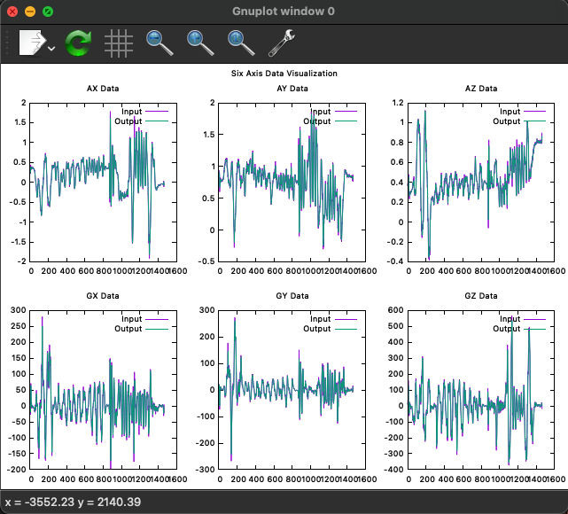

## Installation


### Compiling the Program
To compile the program, use the make command. Ensure you have a Makefile in your project directory. Run the following command in the terminal:


```cd build && make```
This command will compile the source files and generate the executable.

Installing gnuplot
The program requires gnuplot for data visualization. Follow these steps to install gnuplot:

For Debian/Ubuntu based distributions:
```sudo apt-get update
sudo apt-get install gnuplot```


For Red Hat/Fedora based distributions:
```sudo dnf install gnuplot
```


For macOS (using Homebrew):
```brew install gnuplot
```


### Getting Help
To understand how to use the program, you can use the -h option which provides help and usage information. Run the program with the -h option as follows:


```./main -h
```

This will display help information including usage instructions.

